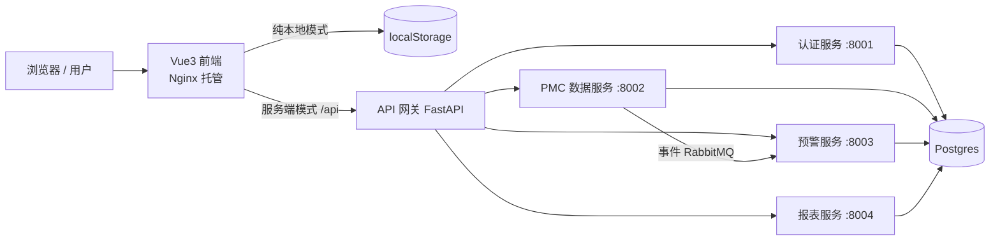

# PMC 管理工作台（大师哥）

> **非商业用途声明：本项目仅供学习、研究、内部演示使用，禁止用于任何商业用途。**
> 详见 [LICENSE.md](./LICENSE.md)。

一个面向生产与物料控制（PMC，Production & Material Control）的全栈管理工作台：
**前端 Vue3 单页应用 + 后端 FastAPI 微服务**，支持**双模式**运行。

---

## 一、双模式说明（重要）

| 模式 | 说明 | 何时使用 |
| --- | --- | --- |
| **纯本地模式**（默认） | 前端独立运行，所有数据存浏览器 `localStorage`，刷新不丢失，无登录注册、不上传云端、可新增/删减/编辑/归档/导出。**符合你原始需求规格。** | 单人日常使用、离线环境、演示 |
| **服务端模式** | 前端连接 FastAPI 微服务（JWT 鉴权、RabbitMQ 事件驱动、Postgres 存储、Docker 部署），支持多用户协作与团队部署。**符合你提出的工程化架构要求。** | 团队协作、云端/服务器部署、生产环境 |

- 前端在两种模式下界面完全一致，切换方式：`frontend/.env` 中设置 `VITE_MODE=server`。
- 纯本地模式下后端**不需要运行**；服务端模式需按下文启动微服务集群。

## 二、功能清单（对应需求规格）

- **双栏布局**：左侧深色永久固定悬浮侧边栏、白色字体竖向排列、选中项深蓝高亮、分组可折叠、系统设置固定在底部、顶部标题「大师哥的 PMC 管理工作台」、响应式布局（移动端抽屉式菜单）。
- **数据能力**：所有页面自动保存、可新增/编辑/删除/归档/恢复/导出（CSV）、批量导入、数据全量备份/恢复、一键重置。
- **PMC 总览（仪表盘）**：计划达成率、物料齐套率、产能利用率、在制工单、库存金额、今日待办 6 大 KPI；关键指标趋势图；订单交期到期倒计时；库存结构饼图；**预警看板**（缺料/交期/采购延期/库存超储低储/呆滞/产能过载/工单延期/品质/损耗/维保/ECN/盘点，点击跳转对应明细）。
- **预警中心**：13 个预警看板/记录页 + 预警规则配置 + 预警处理记录，内置预警引擎按规则自动生成预警。
- **业务板块（100+ 模块页）**：销售订单管理、生产计划管理、物料需求与 BOM、采购与供应商、库存与仓库、生产执行与车间、品质与异常、委外加工、数据报表中心、待办与备忘录——全部由「通用 CRUD 引擎 + 模块配置」驱动，无需逐页开发。
- **刚需辅助工具**：交期推算、产能负荷、物料需求估算、库存周转 4 个计算器；条码单号生成器；日历视图（排程/交期/维保/盘点/待办聚合）；数据批量导入导出；数据对比工具（计划 vs 实际、本期 vs 上期）；操作日志。
- **系统设置**：个人信息、密码（本地演示）、全量导出、基础参数（工厂日历/班次/冻结期）、预警规则参数、编号规则、数据备份恢复、数据清空重置。

## 三、架构



- **微服务拆分**：认证 / PMC 数据 / 预警 / 报表 四个服务 + 统一网关。
- **消息通信**：RabbitMQ（`pmc.data.changed` 事件），数据变更 → 预警服务异步重算，削峰解耦。
- **鉴权**：JWT（`PyJWT`，HS256），网关统一校验，服务间用内部令牌二次校验。
- **安全/反爬**：网关限流（slowapi 按 IP）、安全响应头、CORS 白名单、UA 反爬拦截、危险特征请求过滤、ORM 防注入；Nginx 层同样做反爬与安全头。

## 四、技术栈

- 前端：Vue 3 · Vite 5 · Vue Router · Pinia · Element Plus · ECharts · Axios
- 后端：FastAPI · SQLAlchemy 2 · Postgres/SQLite · PyJWT · pika(RabbitMQ) · slowapi · httpx
- 工程化：Docker Compose · GitHub Actions CI/CD · Nginx

## 五、目录结构

```
PMC_Manager/
├── frontend/                  # Vue3 前端
│   ├── src/
│   │   ├── layout/            # 双栏布局（侧边栏/顶栏）
│   │   ├── views/             # 仪表盘/工具/设置
│   │   ├── components/        # 通用 CRUD 引擎、图表
│   │   ├── data/              # 菜单树 + 100+ 模块字段配置 + 示例数据
│   │   ├── store/             # Pinia（数据/设置/日志，localStorage 持久化）
│   │   ├── utils/             # 导入导出、编号生成、预警引擎
│   │   └── api/               # 服务端模式 API 客户端
│   ├── Dockerfile  nginx.conf
├── backend/                   # FastAPI 微服务
│   ├── common/                # 配置/安全/DB/RabbitMQ/模型
│   ├── gateway/               # API 网关（JWT/限流/反爬/转发）
│   └── services/
│       ├── auth/              # 认证服务
│       ├── pmc/               # 数据服务
│       ├── warning/           # 预警服务
│       └── report/            # 报表服务
├── docker-compose.yml
├── .github/workflows/         # CI / CD
└── LICENSE.md                 # 非商用许可证
```

## 六、快速开始

### 方式一：纯本地模式（无需后端）
```bash
cd frontend
npm install
npm run dev        # 打开 http://localhost:5173
```
所有数据自动保存到浏览器 localStorage，刷新不丢失。

### 方式二：全栈 Docker 部署（服务端模式）
```bash
cp .env.example .env            # 修改 JWT_SECRET / INTERNAL_TOKEN
docker compose up -d --build
# 前端 http://localhost:8080
# 网关文档 http://localhost:8000/docs
# RabbitMQ 控制台 http://localhost:15672 (guest/guest)
```
默认账号：`admin / admin123`（首次登录后请立即修改）。

### 方式三：本地起后端（开发）
```bash
cd backend
python -m pip install -r requirements.txt
# 先启动 RabbitMQ 与 Postgres（或用 SQLite 快速体验：DATABASE_URL=sqlite:///./pmc.db）
uvicorn gateway.main:app --port 8000
uvicorn services.auth.main:app --port 8001
uvicorn services.pmc.main:app --port 8002
uvicorn services.warning.main:app --port 8003
uvicorn services.report.main:app --port 8004
```

## 七、测试与 CI/CD

```bash
cd backend && python -m pytest tests/ -q   # 后端冒烟测试
cd frontend && npm run build               # 前端构建校验
```
- **CI**（`.github/workflows/ci.yml`）：每次推送/PR 自动执行前端构建 + 后端测试 + Docker 构建。
- **CD**（`.github/workflows/cd.yml`）：推送到 main / 打 tag 时构建并推送镜像到 GHCR，并通过 SSH 自动部署到服务器（需配置 `DEPLOY_HOST/DEPLOY_USER/DEPLOY_SSH_KEY` 等 Secrets）。

## 八、扩展：新增业务模块

无需写新页面，只需在 `frontend/src/data/modules/` 任一文件中追加一条配置：
```js
{ key: 'my_module', label: '我的模块', group: '销售订单管理',
  fields: [ text('单号', 150), num('数量'), date('日期'), statusField() ] }
```
保存后左侧菜单自动出现，增删改查/归档/导入导出全部可用。如需服务端同步，在服务端模式下数据写入 Postgres。

## 九、安全加固清单（生产部署必读）

1. 更换 `JWT_SECRET`、`INTERNAL_TOKEN`、数据库密码、RabbitMQ 密码（.env）。
2. `CORS_ORIGINS` 填写实际前端域名，不要使用 `*`。
3. 关闭默认账号或修改 `admin` 密码。
4. 网关已内置限流与反爬，如需更强防护可接入 WAF / 云防火墙。
5. 「支持百万级并发」属架构目标：当前为单体式微服务（各服务可独立水平扩容，通过 Nginx/网关负载均衡 + 队列削峰），实际吞吐取决于部署规格，请按需扩容并做压测。

## 十、License

非商业使用许可证（详见 [LICENSE.md](./LICENSE.md)）。未经许可，禁止用于任何商业场景。
